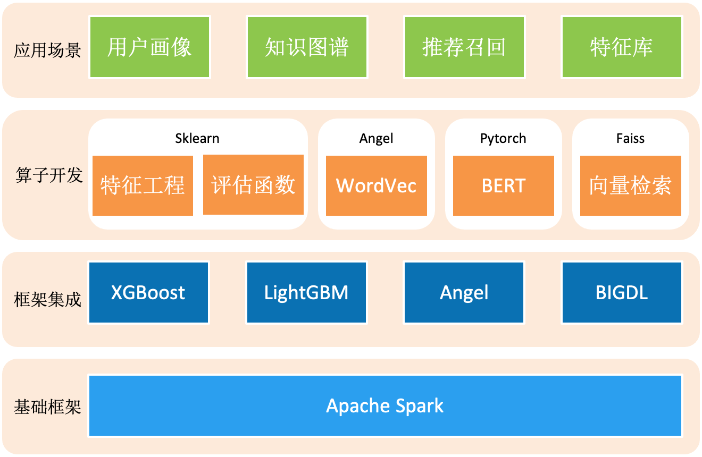

# EasyML

> EasyML是基于Spark开发的算法库，致力于分布式机器学习算法、图算法、深度学习算法的开发
>
> 主要特性如下：
>
> - EasyML遵循Spark ML API，内置了丰富的机器学习算子，持续整合优秀开源框架（例如：Sklearn，Xgboost，Lightgbm等）。
> - EasyML支持用Json配置文件指定模型参数，配合命令行，构建模型训练、评估和预测的流程。
> - EasyML具备可扩展性，用户可自定义算子，通过插件的方式加载，从而在配置文件中使用该算子。
> - EasyML支持运行时编译/执行scala脚本，降低开发成本，无需打Jar包。

### 环境

- JDK: 1.8
- Scala: 2.11.8
- Spark: 2.3.2
- Xgboost: 0.82
- MMLSpark: v0.18.1
- LightGBM: 2.2.350
- Analytics Zoo: 0.8.1
- BigDL: 0.10.0
- DJL: 0.6.0
- Faiss: 1.6.4

### [编译安装](docs/building-easyml.md)

### [快速开始](docs/quick-start.md)

### [配置文件](docs/configuration.md)

### [Sklearn on EasyML](docs/ml-sklearn.md)

### [API文档](docs/api.md)

### [开发手册](docs/programming-guide.md)

### [常见问题](docs/QA.md)