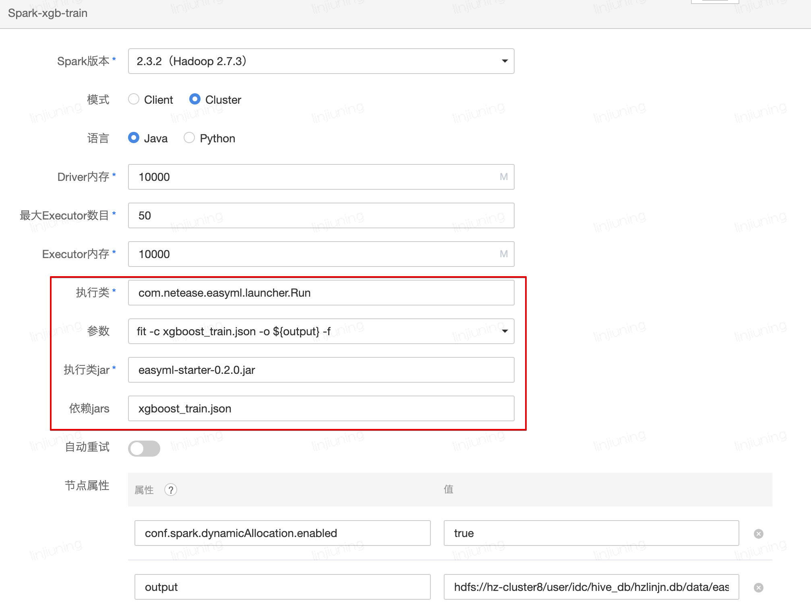

# 配置文件

EasyML支持用Json文件指定模型参数，定制机器学习Pipeline，结合命令行进行模型训练&预测&评估。


## 构建过程

EasyML启动时会将继承自`PipelineStage`接口的类和带有`Register`注解的类注册到注册中心，不同组件通过`type`字段（默认为类的SimpleClassName，或通过Register的name字段指定）唯一区分。EasyML读取Json配置文件，通过`type`字段找到注册类，通过反射构建组件实例。

- 组件注册：

  1. 自动注册：继承自PipelineStage接口的类，组件id为SimpleClassName

     ```scala
     class FMWithSGDClassifier extends PipelineStage {…}
     ```

  2. 手动注册：带有Register注解的类，组件id为name和alias

     ```scala
     @Register(name = “accuracy”, alias = Array(“acc”))
     class AccuracyScore {…}
     ```


## 变量&占位符

- SQL占位符

  示例SQL

  ```sql
  insert overwrite table ${table} partition(pt_d=\"${easyml.latest}\") select * from __THIS__
  ```

  - 特殊占位符
    - ${table}：表名，配置文件或命令行参数指定
    - \_\_THIS__：结果Dataframe

  - 时间占位符

    - ${easyml.latest}：最新分区

    - ${easyml.N.days.ago}：程序运行时的前N天，格式：yyyy-MM-dd
    - ${easyml.current.date}：程序运行时的当前日期，格式：yyyy-MM-dd


## 核心字段

- env

  指定easyml，djl和spark环境变量

  | easyml环境变量        | 说明                                                         |
  | --------------------- | ------------------------------------------------------------ |
  | easyml.package.prefix | 若用户自定义了组件，可通过该变量设置要注册组件的包前缀，然后才能在配置文件中引用该组件 |
  | easyml.jars.dir       | 指定运行时加载jar包的路径，默认easyml.jars.dir=hdfs://hz-cluster8/user/idc/hive_db/hzlinjn.db/data/easyml-0.2.0/jars |
  | easyml.jars.exclude   | 指定运行时不加载jar包名称，默认easyml-common,easyml-launcher,reflections |
  | easyml.hanlp.portable | 是否使用hanlp-portable模式，默认true                         |

  | DJL环境变量             | 说明                                                         |
  | ----------------------- | ------------------------------------------------------------ |
  | ai.djl.engine_cache_dir | 若用户自定义了组件，可通过该变量设置要注册组件的包前缀，然后才能在配置文件中引用该组件 |
  | ai.djl.default_engine   | 默认引擎，可选MXNet（默认），PyTorch，大小写敏感             |

  示例：

  ```json
  {
    "env": {
      "spark.task.cpus": 2
    }
  }
  ```

  

- train：训练集路径

  示例：

  ```json
  {
    "train": "toy_dataset/iris/iris.data"
  }
  ```

  

- validation：验证集路径（可选）

  示例：

  ```json
  {
    "validation": "toy_dataset/iris/iris.data"
  }
  ```

  

- reader：数据读取

  支持从文件和表中读取数据，所有数据默认都用reader读取，也可单独指定

  1. train_reader：训练集读取
  2. validation_reader：验证集读取
  3. test_reader：测试集读取，用于transform
  4. result_reader：结果集读取，用于metric

  示例：

  ```json
  {
    "reader": {
      "type": "basic",
      "format": "csv",
      "options": {
        "header": "false",
        "delimiter": ","
      },
      "schema": "sepal_length DOUBLE, sepal_width DOUBLE, petal_length DOUBLE, petal_width DOUBLE, class STRING"
    }
  }
  ```

  

- component：负责模型的构建

  可通过@path指定路径，读取训练好的模型，若读取sklearn训练的模型，path文件名后缀必须为`.pkl`

  示例：

  ```json
  {
    "component": {
      "type": "Pipeline",
      "stages": [   
          {
            "type": "StringIndexerModel",
            // 读取已训练模型
            "@path": "some path",
            "inputCol": "class",
            "outputCol": "class_index"
          },
          {
            "type": "VectorAssembler",
            "inputCols": ["sepal_length", "sepal_width", "petal_length", "petal_width"],
            "outputCol": "features"
          },
          {
            "type": "XGBoostClassifier",
            "eta": 0.1,
            "maxDepth": 2,
            "objective": "multi:softprob",
            "numClass": 3,
            "numRound": 100,
            "numWorkers": 2,
            "nthread": 2,
            "featureCol": "features",
            "labelCol": "class_index"
          }
      ]
    }
  }
  
  ```

  

- trainer：可选，默认BasicTrainer，可以指定交叉验证

  示例：

  ```json
  {
    "trainer": {
      "type": "basic",
      "split": {
        "type": "ShuffleSplit",
        "nSplits": 1,
        "testSize": 0.2
      }
    }
  }
  ```
  
  

- metric：评估方法，可以包含多个评估指标

  示例：

  ```json
  {
    "metric": [
      {
        "type": "f1",
        "labelCol": "class_index"
      },
      {
        "type": "acc",
        "labelCol": "class_index"
      }
    ]
  }
  ```

  

- writer：预测结果写入文件或表中

  示例：

  ```json
  {
    "writer": {
      "type": "basic",
      "format": "json",
      "mode": "overwrite"
    }
  }
  ```

  

## 命令参数

- fit
  - 训练模型，若指定了验证集，则会评估验证集
  - 参数
    - -c，--config：指定配置文件位置，可以为本地路径，hdfs路径，或者classpath路径
    - -o，--output-dir：指定模型保存路径
    - -f，--force：若保存路径已存在，是否覆盖
  - 示例
    - fit -c config.json -o model_dir
  
- transform
  - 数据处理或者模型预测，数据默认由配置文件test字段指定
  - 参数
    - -a，--archive-file：可选，模型保存路径
    - -c，--config：可选，配置文件config.json，-a和-c至少指定一个
    - -t，--test：预测文件路径
    - -r，--result：结果保存路径
  - 示例
    - transform -a model_dir -t test.csv -r result.json
  
- evaluate
  - 模型预测&评估，数据由配置文件validation字段指定
  - 参数
    - -a，--archive-file：模型保存路径
  - 示例
    - evaluate -a model_dir
  
- metric
  - 预测结果评估
  - 参数
    - -c，--config：配置文件路径，需要用到reader组件
    - -r，--result：预测结果路径
  - 示例
    - metric -c config.json -r result.json
  
- script

  - 执行scala脚本

  - 参数

    - -s，--script：脚本文件，多个文件`,`分隔
- -a，--args：可选，脚本命令行参数，多个参数`,`分隔
    - -c，--config：可选，配置文件，设置`env`环境变量
- -e，--env：可选，设置`env`环境变量，格式`key=value`，多个参数`,`分隔
    
- 示例
  
  - script -s Script.scala -a args1,args2
  
    


## 业务示例

下面以年龄预估为例，说明配置文件的内容和命令行的使用

1. 训练

   - 配置文件xgboost_train.json

     ```json
     {
       "env": {
         // 扩展了metric组件：AgeAccuracyReport，AgePRReport
         "easyml.package.prefix": "com.netease.feature"
       },
       "reader": {
         "type": "sql",
         "sqls": [
           "select * from ${table}"
         ]
       },
       "component": {
         "type": "Pipeline",
         "stages": [
           {
             "type": "ToDenseVector",
             "inputCol": "features",
             "outputCol": "features"
           },
           {
             "type": "XGBoostClassifier",
             "eta": 0.3,
             "maxDepth": 6,
             "subsample": 0.6,
             "objective": "multi:softprob",
             "growPolicy": "lossguide",
             "evalMetric": "merror",
             "minChildWeight": 10.0,
             "numClass": 33,
             "numRound": 10,
             "numWorkers": 50
           }
         ]
       },
       "metric": [
         {
           "type": "age_acc",
           "diff": [3, 4, 5]
         },
         {
           "type": "age_pr",
           "diff": 3
         }
       ],
       "train": "dev.tmp_easyml_age_train",
       "validation": "dev.tmp_easyml_age_validation_small"
     }
     ```

   - 命令

     ```bash
     fit -c xgboost_train.json -o ${archive} -f
     ```

2. 评估

   - 命令

     ```bash
     evaluate -a ${archive} -v dev.tmp_easyml_age_validation_large
     ```

3. 预测

   - 配置文件xgboost_predict.json

     ```json
     {
       "env": {
         "fs.defaultFS": "hdfs://hz-cluster8",
         "easyml.package.prefix": "com.netease.feature"
       },
       "reader": {
         "type": "basic",
         "format": "parquet",
         "columns": ["user_id", "attr_set", "vector"]
       },
       "component": {
         "type": "Pipeline",
         "stages": [
           {
             "type": "ColumnRenamed",
             "inputCols": ["attr_set", "vector"],
             "outputCols": ["prefs", "features"]
           },
           {
             "type": "PipelineModel",
             "@path": "hdfs://hz-cluster8/user/idc/hive_db/hzlinjn.db/data/easyml/age/data"
           },
           {
             "type": "ToDoubleArray",
             "inputCol": "probability",
             "outputCol": "probability"
           },
           {
             "type": "ColumnRenamed",
             "inputCols": ["prediction", "probability"],
             "outputCols": ["age", "prob"]
           }
         ]
       },
       "writer": {
         "type": "sql",
         "sqls": [
           "drop table if exists ${table}",
           "create table if not exists ${table} stored as parquet as select * from __THIS__"
         ]
       }
     }
     ```

   - 命令

     ```bash
     transform -a xgboost_predict.json -t user/idc/hive/warehouse/prophet.db/dwb/par/multi/dwb_par_multi_user2vec_wd/pt_w=2020-07-17 -r dev.tmp_easyml_age_prediction
     ```


## 猛犸使用教程


1. 上传jar包和配置文件

   jar包：easyml-starter.jar和业务jar包

2. 指定执行类

   com.netease.easyml.launcher.Run

3. 指定执行jar

   easyml-starter-0.2.0.jar

4. 指定参数

   例如训练：fit -c config.json -o my_hdfs_path

5. 指定依赖jar

   包括配置文件和业务jar包，easyml依赖的jar包会运行时从hdfs自动加载

6. 示例工程

   1. 年龄预估：easyml_age_embedding_v1
   2. 性别预估：easyml_gender_nickname_v1
   
7. spark节点示例

